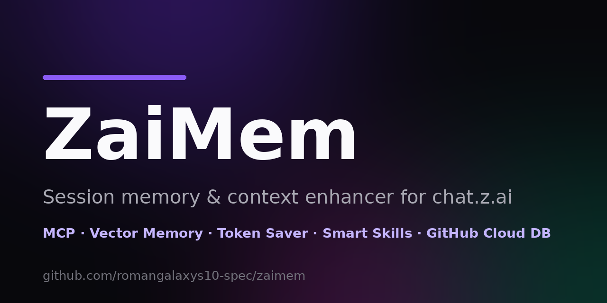

# ZaiMem

[](https://github.com/romangalaxys10-spec/zaimem/actions/workflows/ci.yml)
[](https://github.com/romangalaxys10-spec/zaimem/pkgs/container/zaimem)
[](./LICENSE)
[](https://nextjs.org)
[](https://typescriptlang.org)
[](https://modelcontextprotocol.io)
[](https://github.com/romangalaxys10-spec/zaimem/pulls)

[](https://zaimem.space-z.ai/)
[](https://z.ai/subscribe?ic=ROK78RJKNW)
[](https://rommark.dev)
[](https://t.me/VibeCodePrompterSystem)
[](https://claw.rommark.dev)
[](https://zhelp.space-z.ai/)

<a href="https://zaimem.space-z.ai/"></a>

> 🌐 **[Launch the live demo →](https://zaimem.space-z.ai/)** — no signup: open the app and a private `zm_…` token is generated for you instantly. Paste the magic prompt into any chat.z.ai agent chat and watch the memory, context boost and token savings appear in your dashboard.

**Session memory & context enhancer for AI agents like [chat.z.ai](https://chat.z.ai)** — an MCP-powered web service that gives any chat.z.ai agent persistent **vector memory**, automatic **context enhancement**, **token saving**, and **smart-skill orchestration** — with every user's data mirrored to their **own private GitHub repo** as a human-readable cloud database.

```
┌──────────────┐   1. visit    ┌───────────────────┐  2. auto private token
│  ZaiMem web  │ ────────────► │  token issued &   │ ────────────────────────┐
│     app      │               │  stored locally   │                         ▼
└──────────────┘               └───────────────────┘          ┌─────────────────────────────┐
                                                              │ 3. login → get MAGIC PROMPT │
                                                              │ (endpoint + key embedded)   │
                                                              └──────────────┬──────────────┘
                                                                             ▼
┌─────────────────────────────────────────────────────────────────────────────────────────┐
│ 4. paste prompt into a new chat.z.ai AGENT-mode chat                                    │
│    → session auto-synced: vector memory, context enhancement, token saving, skills      │
└─────────────────────────────────────────────────────────────────────────────────────────┘
                                                                             │
                                     ┌───────────────────────────────────────┘
                                     ▼
              5. pair GitHub PAT → private repo auto-created
                 → ALL data auto-synced (repo = user's cloud DB)
```

## Features

- **Automated private tokens** — no signup: visit the app, get a `zm_…` token instantly, log in with it.
- **Magic prompt (universal)** — the dashboard generates a ready-to-paste activation prompt with your MCP endpoint and key embedded. Works in any MCP-capable agent: chat.z.ai, Claude Code, Cursor, Cline, Windsurf, Trae, Antigravity, zcode, Koda, Pi, Grok and more.
- **MCP server** (JSON-RPC 2.0, streamable HTTP) — 33 tools in 8 togglable **tool packs**, 4 resources, prompt templates, batch calls, session ids, CORS.
- **Document ingestion** — `zaimem_ingest_file` MCP tool + dashboard drag-and-drop upload (PDF / DOCX / TXT / MD / CSV / code): text is auto-chunked into ~600-token overlapping pieces, every chunk is embedded as a `document` memory tagged with its source filename, and re-ingestion is idempotent (same content hash → no-op; changed file → chunks replaced). Recall hits cite `[doc:file.pdf · part i/N]`.
- **Pinned memories** — `zaimem_remember {pinned: true}` (or one click in the dashboard) marks a memory as always-in-force: it is injected into every `zaimem_enhance_context` block and gets a recall ranking boost.
- **Right to be forgotten** — `zaimem_forget` MCP tool with a two-phase preview → confirm flow: match by id, semantic query, kind, source filename (purge a whole document) or created-before date; dashboard rows also support inline edit (re-embeds instantly) and pin toggle.
- **Pre-created sessions & handoffs** — create a session *before* the work starts (title + brief + optional project), then copy its generated **bootstrap prompt** into a fresh agent chat in any IDE: the agent syncs onto that exact session with the brief, summary, key memories and open tasks baked in. Every existing session (even auto-created ones) has a **Continue elsewhere** prompt.
- **Projects — agent teams** — a project is a shared workspace: team instructions, attached files/prompts and a shared memory namespace. Connect one or many agents (via the dashboard or `zaimem_project_brief {project, agent, role}`); agents see the roster, the brief, the files and everything teammates shared — and leave structured `zaimem_project_handoff` notes (done / in_progress / blocked) so the next agent picks up cleanly. Like a team of devs with one shared brain.
- **Meeting intelligence (Tactiq-style, self-hosted)** — paste a Google Meet / Zoom / Teams transcript: ZaiMem chunks + embeds the full transcript, writes an LLM summary with every decision, extracts **action items** and pushes them onto the global tasks board. Ask across all meetings with `zaimem_meeting_search` ("what did we decide about X?").
- **Universal tools** — the zero-config staples from the MCP ecosystem, wired into memory: `zaimem_web_search` + `zaimem_web_fetch` (JS-rendered pages, optional auto-ingest as searchable memory), `zaimem_calc` (safe arithmetic, no code execution), `zaimem_time` (IANA timezones), `zaimem_think` (ledger-backed sequential-thinking scratchpad that survives compaction).
- **HEADROOM compression mode** — togglable (dashboard switch or `zaimem_headroom {enabled}`), inspired by [headroomlabs-ai/headroom](https://github.com/headroomlabs-ai/headroom): when ON, every context injection is compressed harder (shorter excerpts, skill protocols withheld) to preserve context-window headroom, while originals stay full-fidelity in the store and remain retrievable via `zaimem_doc_read` / `zaimem_recall`. Lifetime tokens freed are counted per account.
- **Local vector memory** — 384-dim hashed word/bigram/char-4gram embeddings with cosine recall; auto-dedupe (0.94 duplicate / 0.80 merge thresholds), recency + keyword boosts, context-block assembly.
- **Token saver** — LLM-powered digests (with extractive fallback) compress long context; token accounting per action.
- **Smart skills** (zcode-smart-skill integration) — 8 builtin SKILL.md skills (`smart`, `context-boost`, `token-frugal`, `meeting-notes`, `web-research`, `session-continuity`, `project-team`, `doc-memory`), auto trigger detection, difficulty budgets (E5: 2/6/12), ledger pages (`notes.md`, `tasks.json`) with size budgets, handoff brief with TRUST clause, reflection schema. Every skill and every tool pack has an on/off switch in the Skills tab.
- **GitHub Cloud DB (free hosting)** — pair a GitHub PAT (pre-filled token link, 2 minutes, free — private repos cost nothing) and a private repo is auto-created in YOUR account; every session, memory, project & file is auto-synced in real time (sha-based idempotent pushes, 4s debounced, full audit trail). Your memory stops consuming ZaiMem's local storage entirely — the dashboard keeps the recommendation visible until you pair.
- **Scheduled daily backup** — an optional heartbeat push of a full snapshot ~every 24h (configurable via `ZAIMEM_BACKUP_HOURS`), even when nothing changed — proof the backup pipeline is alive. Toggle it in the Cloud DB panel.
- **One-PAT account rescue** — fresh token / new account, but your old ZaiMem already synced to a private GitHub repo? Point the Cloud DB tab's rescue card at that repo (`owner/name` + PAT): memories are re-imported through the dedupe engine (safe to run twice), sessions come back with titles and summaries, and skills you don't have yet are added. Pairing not required, nothing deleted.
- **Global search (⌘K)** — one query across all sessions, memories (vector + substring), ledger pages and skills, with jump-to-result navigation. Filter results by kind (sessions / memories / ledger / skills) and by date range (24 h → 1 year) right from the command bar.

## Quick start

> ⚡ Fastest path: **[open the hosted instance](https://zaimem.space-z.ai/)** — nothing to install. The steps below are for running your own copy.

### Clone & run locally

```bash
# 1. clone the repo
git clone https://github.com/romangalaxys10-spec/zaimem.git
cd zaimem

# 2. install dependencies (bun ≥ 1.2 recommended; npm/pnpm work too)
bun install

# 3. configure env
cp .env.example .env        # SQLite by default

# 4. create the database schema
bun run db:push

# 5. run
bun run dev                 # http://localhost:3000
```

Production build: `bun run build` → `bun run start` (standalone output on `localhost:3000`).

### Deploy with Docker (public demo / self-host)

Every push to `main` publishes a fresh image to GHCR via Actions (`docker.yml`):

```bash
# pull the prebuilt image and run — http://localhost:3000
docker pull ghcr.io/romangalaxys10-spec/zaimem:latest
docker run -d -p 3000:3000 -v zaimem-db:/app/db ghcr.io/romangalaxys10-spec/zaimem:latest

# or build & run from source in one command
docker compose up --build -d

# or without compose
docker build -t zaimem .
docker run -d -p 3000:3000 -v zaimem-db:/app/db zaimem
```

Image tags: `latest` (default branch), `vX.Y.Z` / `vX.Y` (git tags), short `sha-*`, and the branch name. Browse all tags on the [package page](https://github.com/romangalaxys10-spec/zaimem/pkgs/container/zaimem).

The SQLite database lives in the `zaimem-db` volume (mounted at `/app/db`) and survives rebuilds. Healthcheck, restart policy and env knobs are pre-configured in `docker-compose.yml`.

| Env var | Default | Purpose |
|---|---|---|
| `DATABASE_URL` | `file:/app/db/custom.db` | SQLite location (inside the volume) |
| `ZAIMEM_BACKUP_HOURS` | `24` | Scheduled cloud-DB backup interval (hours, 0.02–168) |
| `ZAIMEM_SCHEDULER` | `on` | Set `off` to disable the background backup loop |

Expose port 3000 through your reverse proxy / tunnel (Caddy, nginx, Cloudflare Tunnel) for a public demo — all agent traffic goes through the single MCP endpoint `/api/mcp`.

### First run

Then open the app → **Get my private token** → log in → copy the **Magic Prompt** → paste into a new chat.z.ai **agent-mode** chat.

## MCP endpoint

```
POST /api/mcp
Authorization: Bearer <api-key>        # or ?token=<api-key>
Content-Type: application/json
```

The endpoint implements the Model Context Protocol over streamable HTTP (`initialize`, `tools/list`, `tools/call`, `resources/*`, `prompts/*`, batch arrays, `MCP-Session-Id`).

### Tools

| Tool | Purpose |
|---|---|
| `zaimem_sync_session` | Register/sync the current agent session |
| `zaimem_remember` | Store a memory (auto-dedupe + merge, optional `pinned`) |
| `zaimem_forget` | Right-to-be-forgotten: preview → confirm deletion by id/query/kind/source/date |
| `zaimem_ingest_file` | Ingest a whole document: chunk + embed + hash-dedupe, source citations |
| `zaimem_recall` | Vector + keyword recall with recency/importance boosts |
| `zaimem_enhance_context` | Build an injectable context block for the current message |
| `zaimem_save_tokens` | Digest/compress long content and bank the savings |
| `zaimem_detect_skill` | Detect a matching skill for the user's request |
| `zaimem_list_skills` | List registered skills (SKILL.md convention) |
| `zaimem_get_skill` | Fetch one skill's full SKILL.md protocol body |
| `zaimem_ledger_write` | Write a smart-skill ledger page (`notes.md`, `tasks.json`, …) |
| `zaimem_ledger_read` | Read a ledger page |
| `zaimem_session_summary` | Distill an end-of-session summary |
| `zaimem_handoff_brief` | Cross-session handoff brief (TRUST clause) |
| `zaimem_remember_many` | Batch-store up to 25 memories in one round-trip |
| `zaimem_doc_read` | Progressive document loading: outline or one chunk |
| `zaimem_session_status` | History pressure + activity report for a session |
| `zaimem_brief_me` | "What's new since you left" cross-session digest |
| `zaimem_resume` | Resume a session: summary + open tasks + checkpoint diff |
| `zaimem_task_next` | Global task board: pick the next open task |
| `zaimem_session_create` | Pre-create a custom session + get its bootstrap prompt |
| `zaimem_session_prompt` | Bootstrap prompt to continue any session elsewhere |
| `zaimem_project_brief` | Join a project team + get the full brief (roster, files, shared memory) |
| `zaimem_project_handoff` | Structured end-of-shift handoff to teammates |
| `zaimem_ingest_meeting` | Meeting transcript → chunks + summary + action items |
| `zaimem_meetings_list` | List ingested meetings with summaries |
| `zaimem_meeting_search` | "Ask my meetings" — semantic search across transcripts |
| `zaimem_web_search` | Web search (zero API keys) |
| `zaimem_web_fetch` | Read a web page as text (+ optional auto-ingest) |
| `zaimem_calc` | Safe arithmetic calculator (shunting-yard, no code execution) |
| `zaimem_time` | Current time / timezone info |
| `zaimem_think` | Sequential-thinking scratchpad (ledger-backed chain) |
| `zaimem_headroom` | HEADROOM compression mode: status + toggle |

### Resources & prompts

- `zaimem://protocol` — operating protocol (markdown)
- `zaimem://memory` — recent memories (json)
- `zaimem://skills` — skill registry (json)
- Prompt template `zaimem-boot` — boot a ZaiMem-synced session with memory recall

## Dashboard REST API

| Route | Description |
|---|---|
| `POST /api/auth/init` | Issue an automated private token |
| `POST /api/auth/login` | Log in with the token (cookie session) |
| `GET /api/auth/me` | Current user + stats + config |
| `GET/POST /api/sessions`, `GET/DELETE /api/sessions/[id]` | Session management |
| `GET /api/memories`, `POST /api/memories`, `DELETE /api/memories/[id]` | Memory browsing & vector search |
| `GET/PATCH /api/skills` | Skills + MCP tool packs + headroom mode: GET returns all three, PATCH toggles (`{id}` skill · `{packId}` pack · `{headroom}` mode) |
| `GET /api/stats` | Usage statistics (tokens saved, actions) |
| `GET/POST /api/github` | Cloud DB status, pair / unpair / sync / toggle / restore / **import** (new-account rescue) |

## GitHub Cloud DB

Pair your PAT (classic, `repo` scope) from the dashboard's **Cloud DB** tab:

1. PAT is validated against `GET /user` and stored **AES-256-GCM encrypted** (only last 4 chars are ever displayed).
2. A **private** repo (default `zaimem-cloud-db`) is auto-created in your account.
3. Every mutation (memories, sessions, ledger, skills, stats) triggers a debounced auto-sync.
4. Pushes are idempotent — unchanged files are skipped via git blob SHA comparison; your own files in the repo are never touched.
5. **New account?** `POST /api/github {action: "import", pat, repo, branch?}` — or the Cloud DB tab's rescue card — re-syncs an existing cloud-DB repo into the current account (memories + sessions + skills, additive & dedupe-aware).

Repo layout:

```
index.json            # snapshot index + counts
README.md             # human-readable overview (regenerated)
memories.json         # all memories
vectors.jsonl         # 384-dim embeddings, one JSON per line
sessions/<slug>.json  # one file per session (turns, summary, metadata)
skills.json           # skill registry
stats.json            # usage statistics
sync/log.json         # sync audit trail
```

## Tool packs — capability switches

All 33 MCP tools belong to one of 8 packs. Flip a pack off in **Skills → MCP tool packs** and its tools vanish from `tools/list`; a direct call answers with a clear "pack is switched OFF" hint instead of executing. `core-memory` is locked — it is the product:

| Pack | Tools |
|---|---|
| Core memory (locked) | sync_session · remember · remember_many · recall · forget · enhance_context |
| Session continuity | session_status · brief_me · resume · task_next · session_summary · handoff_brief · session_create · session_prompt |
| Project agent teams | project_brief · project_handoff |
| Meeting intelligence | ingest_meeting · meetings_list · meeting_search |
| Document ingestion | ingest_file · doc_read |
| Web & utilities | web_search · web_fetch · calc · time · think |
| Smart skills & ledger | detect_skill · list_skills · get_skill · ledger_write · ledger_read |
| Token saver & headroom | save_tokens · headroom |

## Architecture

```
src/
├── app/api/…            # 12 route handlers (auth, sessions, memories, skills, stats, github, mcp)
├── components/zaimem/…  # landing, dashboard, cloud-db, panels, magic-prompt builder
└── lib/zaimem/
    ├── vector.ts        # hashed n-gram embeddings + cosine engine
    ├── memory.ts        # remember/recall/enhance with dedupe & boosts
    ├── compress.ts      # token saver (LLM digest + extractive fallback)
    ├── skills.ts        # smart-skill engine (triggers, budgets, ledger, handoff)
    ├── mcp.ts           # MCP tool/resource/prompt registry & dispatcher
    ├── github.ts        # PAT validation, repo provisioning, idempotent sync, debounce queue
    ├── crypto.ts        # AES-256-GCM at-rest encryption, blob sha
    ├── auth.ts          # token issuance & session auth
    └── seed.ts          # builtin skills bootstrap
```

Stack: **Next.js 16 (App Router) · React 19 · TypeScript · Tailwind CSS 4 · shadcn/ui · Prisma + SQLite · z-ai-web-dev-sdk**.

## Testing

```bash
bun scripts/e2e-test.ts          # 46 HTTP checks — auth, MCP tools, dedupe, GitHub guards …
bun scripts/e2e-github-unit.ts   # 26 engine checks — full sync engine vs mock GitHub API
```

## Security notes

- Login tokens and API keys are high-entropy random strings; API keys authenticate every MCP call.
- GitHub PATs are encrypted at rest (AES-256-GCM, scrypt-derived key) and never returned by the API.
- The SQLite database and `.env` are local-only and excluded from version control.

## Community & links

| | |
|---|---|
| ⚡ **Built with** | [GLM 5.3 Flash — z.ai](https://z.ai/subscribe?ic=ROK78RJKNW) |
| 👑 **Lead by** | [Roman · Rommark.Dev](https://rommark.dev) |
| ✈️ **Telegram Blog** | [@VibeCodePrompterSystem](https://t.me/VibeCodePrompterSystem) |
| 🟢 **The Claw Blog** | [claw.rommark.dev](https://claw.rommark.dev) |
| 🛟 **Author of** | [Z-Assist Project](https://zhelp.space-z.ai/) |

## License

[MIT](./LICENSE) © RyzenCode
